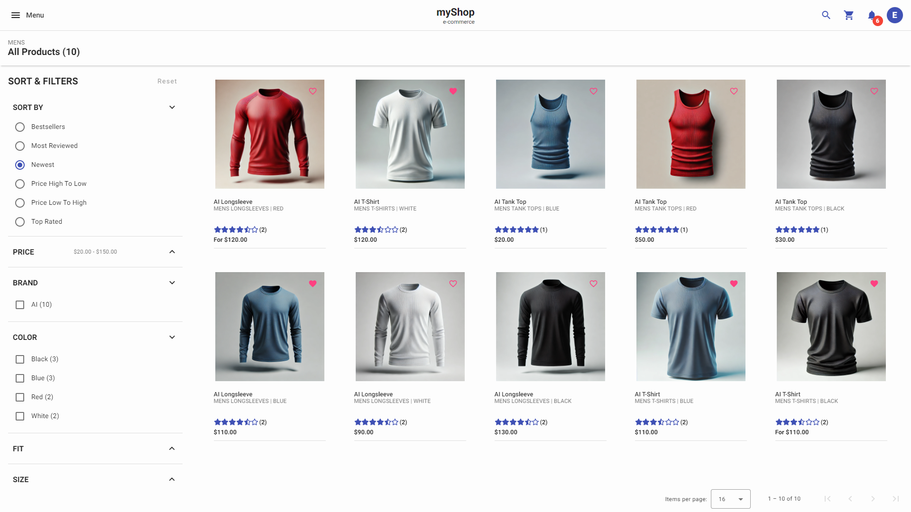
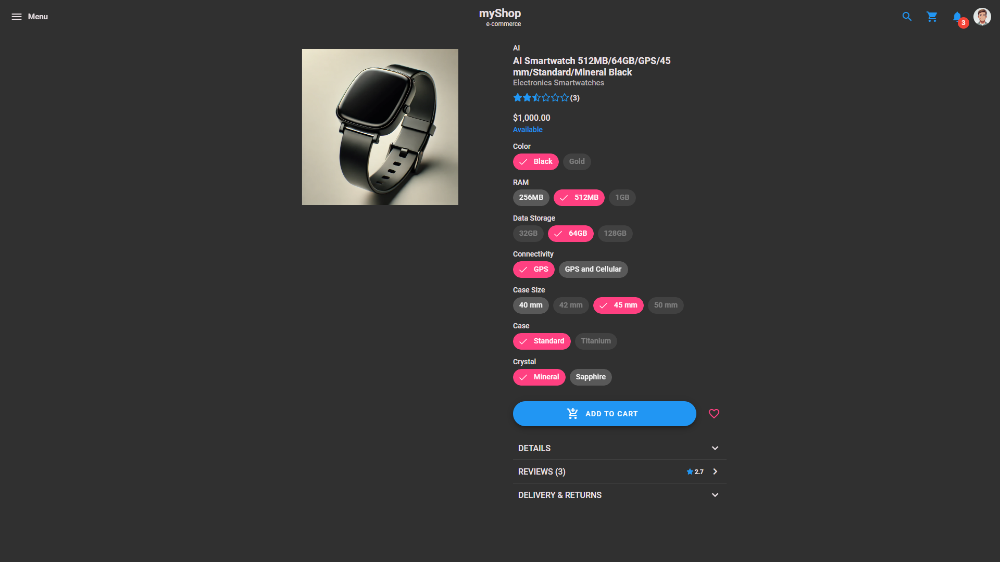
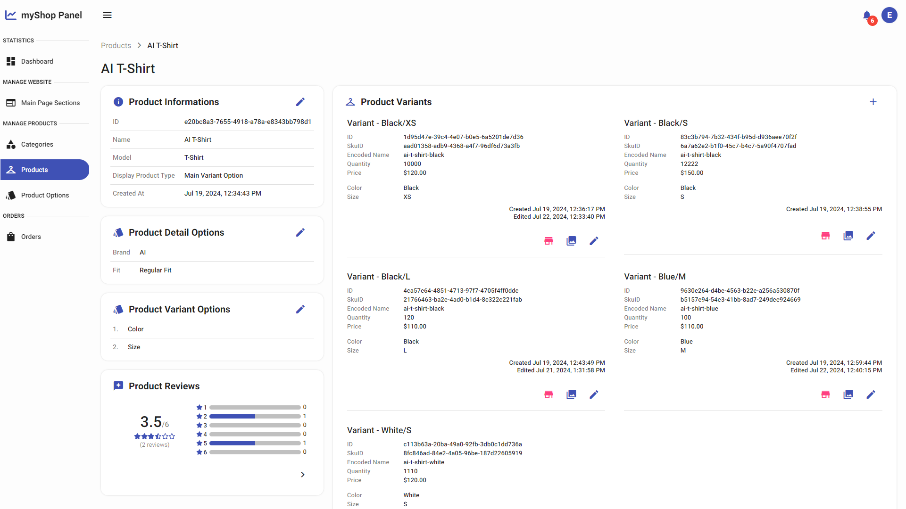

<div align="center"> 
  <h1>myShop Angular Client</h3>
  
  
  
  
  
  
</div>
<br />
<br />

## Table of Contents
1. **[About The Project](#about-the-project)**
    - **[Topics](#the-application-covers-the-following-topics)**
    - **[Built with](#built-with)**
2. **[Screenshots](#screenshots)**
3. **[Related Projects](#related-projects)**
4. **[Getting Started](#getting-started)**
5. **[License](#license)**

## About The Project
The main goal of **myShop Angular Client** project was to learn how to create modern, reactive, responsive Single Page Application, which can communicate with a **[myShop API](https://github.com/marcin-niewczas/MyShop-API)**. 

### The application covers the following topics:
- Angular Router
- Angular Forms/Reactive Forms (built-in and custom validators)
- Built-in and custom Angular Pipes, Directives
- Custom reusable components
- Angular Material Components
- Integration light/dark themes with Angular Material
- Angular Resolvers, Guards, Interceptors
- Angular Services (Dependency Injection)
- Angular Animations
- Managing User Session using JWT and refresh tokens
- TypeScript
- RxJS
- Angular Signals
- Angular Standalone Components
- Diffrent types of paginations (e.g. Query Params, Infinite Scroll)
- Working with external packages
- Angular Service Worker (Progressive Web Application)
- Sass/SCSS (Variables, Mixins)
- RWD (Responsive Web Design)
- Working with REST API and SignalR Hub
- Working with charts

### Built with
* Angular 18
* Angular Material
* Angular Service Worker (PWA)
* Angular Animations
* Sass/SCSS
* Microsoft SignalR
* ngx-toastr
* ngx-infinite-scroll
* Swiper
* ng2-charts (chart.js + chartjs-plugin-datalabels)
* Angular Fontawesome
* hammer.js

## Screenshots
> [!NOTE]
> Screenshots **myShop Angular Client** can be found **[here](./SCREENSHOTS.md)**.

## Related Projects
* **[myShop API](https://github.com/marcin-niewczas/MyShop-API)**
* **[myShop Pay](https://github.com/marcin-niewczas/MyShop-Pay)**

## Getting Started
> [!IMPORTANT]
> For fully functionality, the **myShop Angular Client** project must have **[related projects](#related-projects)** running.
> 
> Full instruction for starting **myShop** projects is **[here](https://github.com/marcin-niewczas/MyShop-API#launch-myshop-projects)**.
1. Clone repository
   ```sh
   git clone https://github.com/marcin-niewczas/MyShop-Angular-Client.git
   ```
2. In root folder of repository install NPM packages
   ```sh
   npm install
   ```
3. Run application
   ```sh
   ng serve
   ```

## License
Distributed under the **MIT License**. See **[LICENSE](./LICENSE)** for more information.
