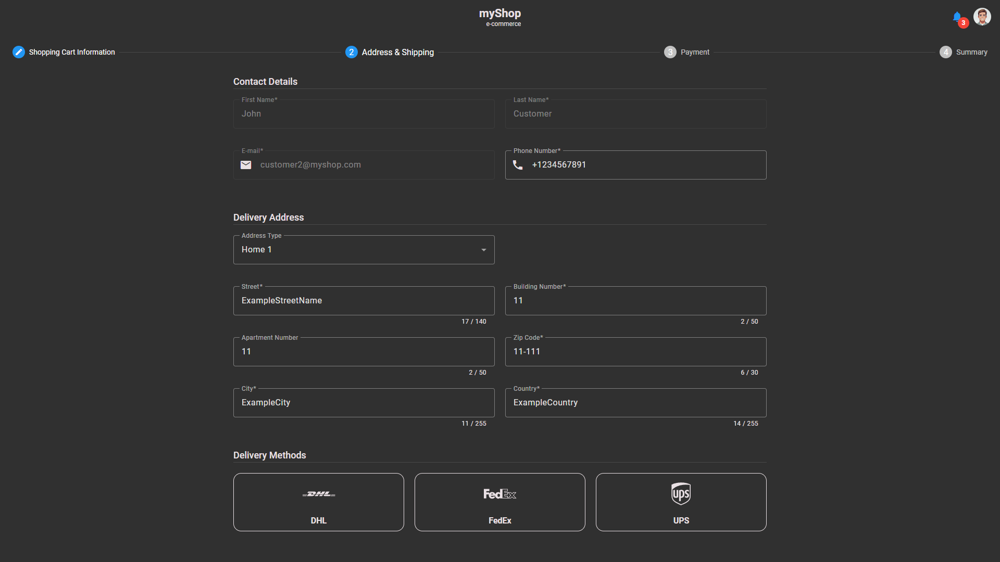
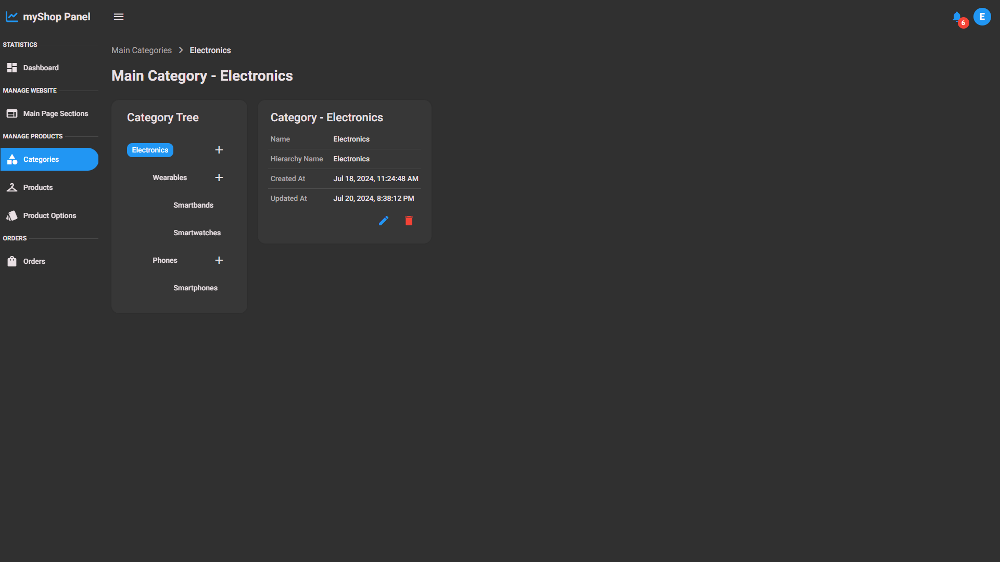
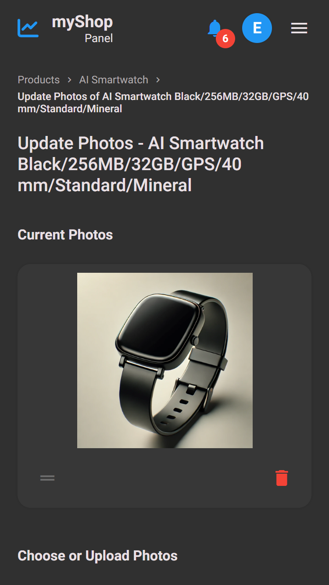

 
  <h3>Screenshots</h3>
  <h6>myShop Angular Client<h6>

## Table of Contents
1. **[Overall](#overall)**
   - **[User Menu](#user-menu)**
     - **[Customer](#customer)**
     - **[Employee](#employee)**    
   - **[Notifications](#notifications)**
   - **[Authenticate](#authenticate)**
   - **[Progressive Web Application](#progressive-web-application)**
3. **[E-Commerce](#e-commerce)**
   - **[Main Page](#main-page)**
   - **[Categories Navigation](#categories-navigation)**   
   - **[Products List](#products-list)**
   - **[Quick Add Product](#quick-add-product)**
   - **[Product](#product)**
   - **[Product Reviews](#product-reviews)**
   - **[Shopping Cart](#shopping-cart)**
   - **[Search Products](#search-products)**
   - **[Ordering](#ordering)**
5. **[Account](#account)**
   - **[Navigation Menu](#navigation-menu)**
   - **[Settings](#settings)**
   - **[Addresses](#addresses)**
   - **[Orders List](#orders-list)**
   - **[Favorites List](#favorites-list)**
   - **[Notifications List](#notifications-list)**
   - **[Security](#security)**
7. **[Management Panel](#management-panel)**
   - **[Navigation Menu](#navigation-menu)**
   - **[Dashboard](#dashboard)**
   - **[Main Page Management](#main-page-management)**
   - **[Categories](#categories)**
   - **[Products](#products)**
   - **[Product Options](#product-options)**
   - **[Orders](#orders)**
8. **[Light Theme](#light-theme)**

## Overall
### User Menu
#### Customer

  
  
<strong>Customer Menu - Desktop</strong>

   
   
  
  
<strong>Customer Menu - Tablet</strong>

   
   
  
  
<strong>Customer Menu - Mobile</strong>

   
   

#### Employee

  
  
<strong>Employee Menu - Mobile</strong>

   
   

### Notifications

  
  
<strong>Notifications - Desktop</strong>

   
   
  
  
<strong>Notifications - Tablet</strong>

   
   
  
  
<strong>Notifications - Mobile</strong>

   
   

### Authenticate

  
  
<strong>Sign In/Sign Up - Desktop</strong>

   
   
  
  
<strong>Sign In/Sign Up - Mobile</strong>

   
   

### Progressive Web Application

  
  
<strong>Progressive Web Application Update Dialog - Desktop</strong>

   
   

## E-Commerce
### Main Page

  
  
<strong>Main Page - Desktop</strong>

   
   
  
  
<strong>Main Page - Mobile</strong>

   
   

### Categories Navigation

  
  
<strong>Categories Navigation - Desktop</strong>

   
   
  
  
<strong>Categories Navigation - Mobile</strong>

   
   

### Products List

  
  
<strong>Products List - Desktop</strong>

   
   
  
  
<strong>Products List - Mobile</strong>

   
   
  
  
<strong>Sort and Filters Products List - Mobile</strong>

   
   

### Quick Add Product

  
  
<strong>Quick Add Product - Desktop</strong>

   
   
  
  
<strong>Quick Add Product - Mobile</strong>

   
   

### Product

  
  
<strong>Product - Desktop</strong>

   
   
  
  
<strong>Product with many variants - Desktop</strong>

   
   
  
  
<strong>Product with many variants - Mobile</strong>

   
   
  
  
<strong>Product with 2 photos - Desktop</strong>

   
   
  
  
<strong>Product with 2 photos - Mobile</strong>

   
   

### Product Reviews

  
  
<strong>Product Reviews - Desktop</strong>

   
   
  
  
<strong>Product Reviews - Mobile</strong>

   
   

### Shopping Cart

  
  
<strong>Shopping Cart - Desktop</strong>

   
   
  
  
<strong>Shopping Cart - Mobile</strong>

   
   

### Search Products

  
  
<strong>Search Products Top Bar - Desktop</strong>

   
   
  
  
<strong>Search Products Top Bar - Mobile</strong>

   
   

### Ordering

  
  
<strong>Order Wizard - Desktop</strong>

   
   
  
  
<strong>Order Wizard - Mobile</strong>

   
   
  
  
<strong>Order Details - Desktop</strong>

   
   
  
  
<strong>Order Details - Mobile</strong>

   
   

## Account
### Navigation Menu

  
  
<strong>Account Navigation Menu - Desktop</strong>

   
   
  
  
<strong>Account Navigation Menu - Tablet</strong>

   
   
  
  
<strong>Account Navigation Menu - Mobile</strong>

   
   

### Settings

  
  
<strong>Account Settings - Desktop</strong>

   
   
  
  
<strong>Account Settings - Mobile</strong>

   
   

### Addresses

  
  
<strong>Account Addresses - Desktop</strong>

   
   
  
  
<strong>Account Addresses - Mobile</strong>

   
   

### Orders List

  
  
<strong>Account Orders - Desktop</strong>

   
   
  
  
<strong>Account Orders - Mobile</strong>

   
   
  
  
<strong>Account Order Details - Desktop</strong>

   
   
  
  
<strong>Account Order Details - Mobile</strong>

   
   

### Favorites List

  
  
<strong>Account Favorites - Desktop</strong>

   
   
  
  
<strong>Account Favorites - Mobile</strong>

   
   

### Notifications List

  
  
<strong>Account Notifications List - Desktop</strong>

   
   
  
  
<strong>Account Notifications List - Mobile</strong>

   
   

### Security

  
  
<strong>Account Security - Desktop</strong>

   
   
  
  
<strong>Account Security - Mobile</strong>

   
   

## Management Panel
### Navigation Menu

  
  
<strong>Management Panel Navigation Menu - Desktop</strong>

   
   
  
  
<strong>Management Panel Hidden Navigation Menu - Desktop</strong>

   
   
  
  
<strong>Management Panel Navigation Menu - Mobile</strong>

   
   

### Dashboard

  
  
<strong>Dashboard - Desktop</strong>

   
   
  
  
<strong>Dashboard - Mobile</strong>

   
   

### Main Page Management

  
  
<strong>Main Page Sections - Desktop</strong>

   
   
  
  
<strong>Main Page Sections - Mobile</strong>

   
   
  
  
<strong>Main Page Section - Desktop</strong>

   
   
  
  
<strong>Main Page Section - Mobile</strong>

   
   

### Categories

  
  
<strong>Main Categories - Desktop</strong>

   
   
  
  
<strong>Main Categories - Mobile</strong>

   
   
  
  
<strong>Category - Desktop</strong>

   
   
  
  
<strong>Category - Mobile</strong>

   
   
  
  
<strong>Category Tree - Mobile</strong>

   
   

### Products

  
  
<strong>Products - Desktop</strong>

   
   
  
  
<strong>Products - Mobile</strong>

   
   
  
  
<strong>Create Product Wizard - Desktop</strong>

   
   
  
  
<strong>Create Product Wizard - Mobile</strong>

   
   
  
  
<strong>Product - Desktop</strong>

   
   
  
  
<strong>Product - Mobile</strong>

   
   
  
  
<strong>Create Product Variant Wizard - Desktop</strong>

   
   
  
  
<strong>Create Product Variant Wizard - Mobile</strong>

   
   
  
  
<strong>Update Product Variant Photos - Desktop</strong>

   
   
  
  
<strong>Update Product Variant Photos - Mobile</strong>

   
    

### Product Options

  
  
<strong>Product Options - Desktop</strong>

   
   
  
  
<strong>Product Options - Mobile</strong>

   
   
  
  
<strong>Product Option - Desktop</strong>

   
   
  
  
<strong>Product Option - Mobile</strong>

   
   

### Orders

  
  
<strong>Orders - Desktop</strong>

   
   
  
  
<strong>Orders - Mobile</strong>

   
   
  
  
<strong>Order - Desktop</strong>

   
   
  
  
<strong>Order - Mobile</strong>

   
   

## Light Theme 

  
  
<strong>E-Commerce Main Page - Mobile</strong>

   
   
  
  
<strong>E-Commerce Products List - Desktop</strong>

   
   
  
  
<strong>E-Commerce Sort and Filters Products List - Mobile</strong>

   
   
  
  
<strong>E-Commerce Product - Desktop</strong>

   
   
  
  
<strong>Account Settings Light Theme - Mobile</strong>

   
   
  
  
<strong>Management Panel Dashboard - Desktop</strong>

   
   
  
  
<strong>Management Panel Product - Desktop</strong>

   
   
  
  
<strong>Management Panel Order - Desktop</strong>

   
   

