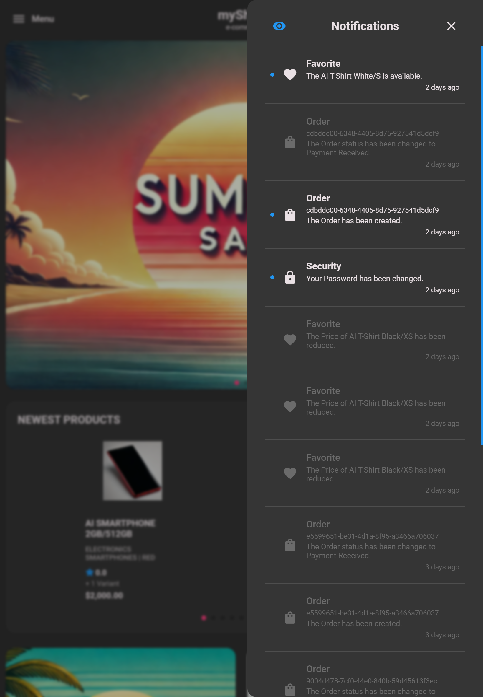
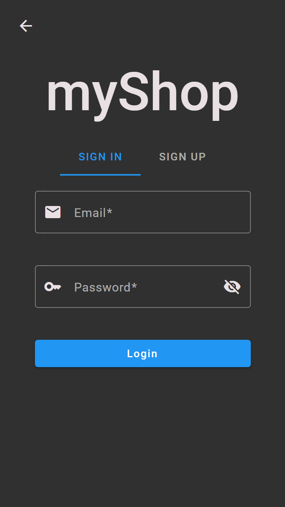

 
  <h3>Screenshots</h3>
  <h6>myShop Angular Client<h6>

## Table of Contents
1. **[Overall](#overall)**
   - **[User Menu](#user-menu)**
     - **[Customer](#customer)**
     - **[Employee](#employee)**    
   - **[Notifications](#notifications)**
   - **[Authenticate](#authenticate)**
   - **[Progressive Web Application](#progressive-web-application)**
3. **[E-Commerce](#e-commerce)**
   - **[Main Page](#main-page)**
   - **[Categories](#categories)**
   - **[Products](#products)**
     - **[Products List](#products-list)**
     - **[Sort and Filters Products List](#sort-and-filters-products-list)**
     - **[Quick Add Product](#quick-add-product)**
     - **[Product](#product)**
     - **[Product Reviews](#product-reviews)**
   - **[Shopping Cart](#shopping-cart)**
   - **[Search Products](#search-products)**
   - **[Order](#order)**
5. **[Account](#account)**
   - **[Navigation Menu](#navigation-menu)**
   - **[Settings](#settings)**
   - **[Addresses](#addresses)**
   - **[Orders](#orders)**
   - **[Favorites](#favorites)**
   - **[Notifications](#notifications)**
   - **[Security](#security)**
7. **[Management Panel](#management-panel)**
   - **[Navigation Menu](#navigation-menu)**
   - **[Dashboard](#dashboard)**
   - **[Main Page Management](#main-page-management)**
   - **[Categories](#categories)**
   - **[Products](#products)**
   - **[Product Options](#product-options)**
   - **[Orders](#orders)**
8. [Light Theme](#light-theme)

## Overall
### User Menu
#### Customer

  
  
<strong>Customer Menu - Desktop</strong>

   
   
  
  
<strong>Customer Menu - Tablet</strong>

   
   
  
  
<strong>Customer Menu - Mobile</strong>

   
   

#### Employee

  
  
<strong>Employee Menu - Mobile</strong>

   
   

### Notifications

  
  
<strong>Notifications - Desktop</strong>

   
   
  
  
<strong>Notifications - Tablet</strong>

   
   
  
  
<strong>Notifications - Mobile</strong>

   
   

### Authenticate

  
  
<strong>Sign In/Sign Up - Desktop</strong>

   
   
  
  
<strong>Sign In/Sign Up - Mobile</strong>

   
   

### Progressive Web Application

  
  
<strong>Progressive Web Application Update Dialog - Desktop</strong>

   
   

## E-Commerce

## Account

## Management Panel
